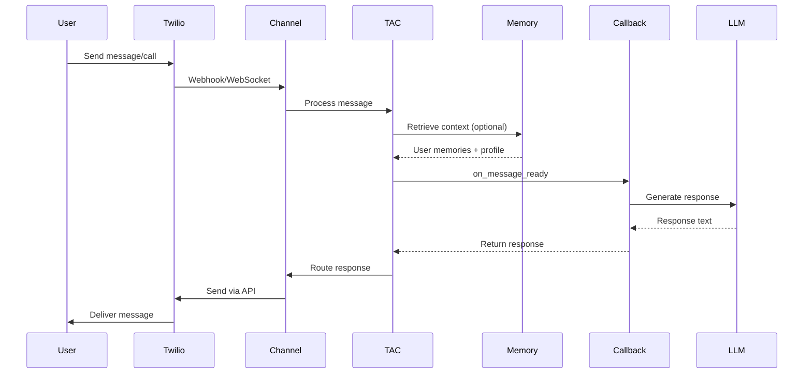

# Architecture

TAC is designed as middleware that connects Twilio's communication channels with your LLM application. Understanding the architecture helps you build more effective agents.

## Core Components

### TAC Class

The central orchestrator that coordinates all components:

```python
from tac import TAC, TACConfig

tac = TAC(config=TACConfig.from_env())
```

Key responsibilities:

- Configuration management
- Memory retrieval coordination
- Callback registration and invocation
- Profile resolution

### Channels

Channels handle communication protocol specifics:

- **Voice**: ConversationRelay WebSocket handling, TwiML generation
- **SMS**: SMS webhook processing
- **RCS**: RCS webhook processing with rich media
- **WhatsApp**: WhatsApp webhook processing
- **Chat**: Multi-platform chat handling

Each channel:

1. Validates incoming webhooks/connections
2. Manages conversation lifecycle
3. Triggers TAC callbacks
4. Routes responses back to Twilio

### Memory System

TAC integrates with Twilio Conversation Memory:

- **Automatic initialization** from Conversation Orchestrator config
- **Three retrieval modes**:
    - `"never"` (default): No automatic retrieval
    - `"always"`: Fetch on every message with semantic search
    - `"once"`: Fetch once, cache until conversation state changes
- **Graceful fallback** to Conversation Orchestrator if Memory unavailable

### Adapters

Adapters inject TAC context into LLM SDKs:

- **OpenAI Adapter**: Memory injection for Chat Completions and Responses APIs
- Automatically formats memory and profile for LLM consumption
- Supports sync/async and streaming

## Message Flow



## Conversation Lifecycle

### Connection Phase

1. Twilio receives user message/call
2. Channel validates and processes
3. Profile lookup (if needed)
4. Memory retrieval (based on mode)
5. Conversation stored in `_conversations`

### Active Phase

- Messages flow through `on_message_ready`
- Memory cache maintained (for `"once"` mode)
- State tracked per conversation

### Cleanup Phase

- Voice: On WebSocket disconnect
- Messaging: On INACTIVE status or conversation end
- Memory cache cleared
- Conversation removed from tracking

## ConversationRelay-Only Mode

TAC can run without Conversation Orchestrator or Memory:

```python
config = TACConfig(
    api_key=os.getenv("TWILIO_API_KEY"),
    api_token=os.getenv("TWILIO_API_TOKEN"),
    # No conversation_configuration_id
)
```

In this mode:

- Only Voice channel works (messaging channels raise at construction)
- `retrieve_memory()` returns empty response
- ConversationRelay callback handles session cleanup
- Perfect for voice-first prototypes

Check at runtime:

```python
if tac.is_orchestrator_enabled():
    # Use memory features
else:
    # Voice-only mode
```

## Scaling Considerations

### Single Instance

TAC works perfectly out of the box for single-instance deployments:

- Conversation tracking in memory (`self._conversations`)
- Automatic cleanup on disconnect/inactivity
- No shared state needed

### Multi-Instance (Horizontal Scaling)

Current architecture has limitations:

- Conversation state is instance-local
- Webhooks may route to different instances
- Can cause memory leaks (conversations not cleaned up)

**Recommended solutions:**

1. **Sticky sessions**: Configure load balancer to route by `conversation_id`
2. **Shared state**: Use Redis or database for `_conversations` tracking

## Key Architecture Patterns

### Memory Fallback Chain

1. Try Conversation Memory first
2. Fall back to Orchestrator's `list_communications()`
3. Return empty response if both fail
4. Never block callback execution

### Profile Resolution

1. Check if `profile_id` in webhook
2. If missing, look up by phone/email
3. Create profile if lookup fails
4. Cache in context for callback

### Async-First Design

- All I/O operations use `httpx.AsyncClient`
- Callbacks are async by default
- Channels handle both sync/async gracefully

### Error Handling Philosophy

- API failures should not crash the agent
- Log errors, return empty/default values
- Let callbacks decide how to handle missing data

## Next Steps

- [Channels Guide](channels.md) - Deep dive into channel implementations
- [Memory Management](memory.md) - Memory retrieval strategies
- [Server Setup](server.md) - Deploying TAC applications
